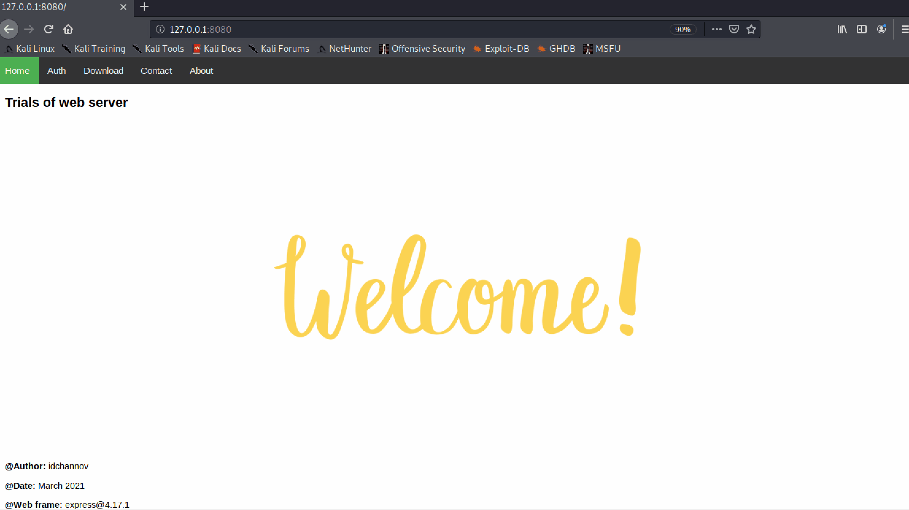

# Simple Web Server

## 1. Preview



## 2. Function

- Authentication (local)

- Download static files

## 3. Instructions

- **How to install**

    ```cmd
    $ git clone https://github.com/ididChan/simple-web-server.git
    $ cd simple-web-server
    $ npm install
    ```

- **Start the server**

    ```cmd
    $ node server.js
    ```
    You can view this sample via http://localhost:8080. Some available (user, password)  are listed below:
    
    - `(idchannov, 123456)`

    - `(id, 111111)`


